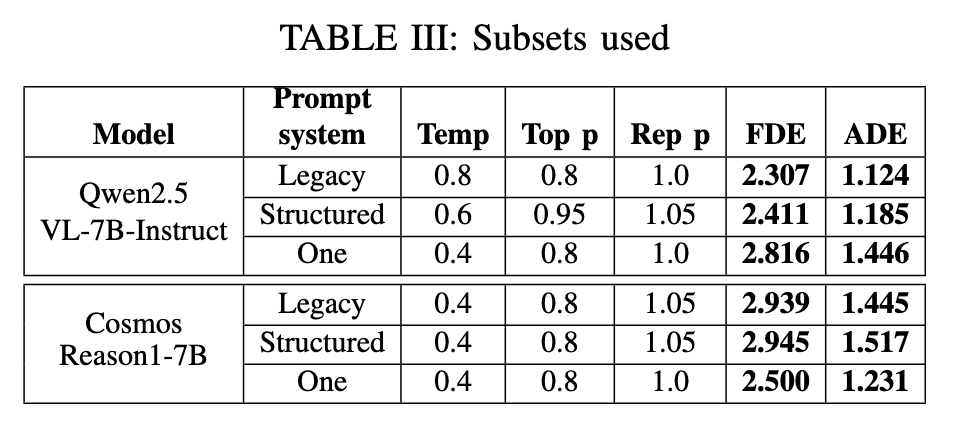

# 4. Prédiction de trajectoire de véhicule

L'objectif de ce projet est de prédire la trajectoire future d'un véhicule en utilisant sa vitesse et sa courbure passées ainsi qu'une image capturée par une caméra frontale.

L'idée est venue de la méthode [LightEMMA](https://github.com/michigan-traffic-lab/LightEMMA) (End to End Multi-Modal Attention for Vehicle Trajectory Prediction) qui utilise des modèles multimodaux pour prédire des trajectoires d'un véhicule à partir de sa caméra frontale et d'informations temporelles sur l'ego du véhicule. C'est une tâche complexe qui nécessite un prompt engineering poussé pour obtenir un résultat correct. Ce projet permettra de pousser les capacités sémantiques de byllm() pour une tâche relativement complexe.

## 4.1. Méthode

Nous avons deux objectifs principaux dans ce projet : répliquer le comportement de [LightEMMA](https://github.com/michigan-traffic-lab/LightEMMA) sur une frame d'une situation de conduite et comparer comment une implémentation en Jac avec byllm() se comporte par rapport à une implémentation classique en Python.

Là où le modèle utilise la librairie Transformers pour charger et inférer un modèle multimodal, nous allons utiliser byllm() interrogeant un modèle local via Ollama. L'implémentation classique utilisera la librairie Ollama pour faire des appels au modèle local.

LightEMMA infère deux fois le modèle pour intégrer une description de la scène et des intentions de conduite dans le prompt final. Nous utiliserons un prompt unique pour la méthode traditionnelle.

Bien que la philosophie de **byllm** soit d'extraire la sémantique du code pour former un prompt automatiquement, le langage Jac propose le type ```Semstrings``` qui permet d'inclure des informations supplémentaires au sujet de variables, fonctions, attributs ou objets. Nous comparerons les résultats avec et sans ces Semstrings pour évaluer leur impact ; nous testerons également une version contenant un prompt manuel passé à la fonction de prédiction comme attribut d'objet.

Formellement, on définit $P$ comme la fonction de prédiction de trajectoire future :

$$
P(I,\ \mathbf{v}_{1:t},\ \boldsymbol{\kappa}_{1:t},\ s)
= \bigl[(v_{t+1},\kappa_{t+1}),\dots,(v_{t+6},\kappa_{t+6})\bigr],
$$

- $I$ : image frontale
- $\mathbf{v}_{1:t}$ : vitesses passées
- $\boldsymbol{\kappa}_{1:t}$ : courbures passées
- $s$ : contexte supplémentaire optionnel (Semstrings ou prompt manuel)

et la sortie est une liste de 6 tuples :

$$
(v_{t+k},\ \kappa_{t+k}) \in \mathbb{R}^2, \qquad k = 1,\dots,6.
$$

Pour faciliter la notation, on peut définir $P_{ss}$ comme la version de $P$ avec Semstrings, $P_{pm}$ comme la version avec prompt manuel, $P_{def}$ la version sans contexte supplémentaire et $P_{py}$ la version Python sans byllm().

Bien que $P_{pm}$ et $P_{py}$ utilisent le même prompt, on peut comparer leur robustesse lors du parsing de la sortie.

## 4.2 Choix du modèle

Ne disposant pas d'accès à l'API de ChatGPT‑4o, nous avons choisi d'utiliser le modèle local qwen2.5VL_8b via Ollama.

Assez petit pour inférer rapidement sur une machine locale, c'est également un modèle déjà benchmarké pour des tâches de prédiction de trajectoire sur le même dataset.

Par contrainte temporelle, nous n'avons pas pu tester d'autres modèles, mais il serait intéressant de comparer les performances de qwen2.5VL_8b avec des modèles plus puissants ou non directement disponibles via Ollama.



## 4.2. Choix d'Évaluation

### Données d'évaluation

Nous utilisons une frame du dataset [nuScenes](https://www.nuscenes.org/) avec la liste de ses vitesses et courbures passées pendant 3 s à 0,5 s d'intervalle (6 valeurs) ainsi qu'une photo capturée par la caméra avant du véhicule (voir Figure \ref{fig:frame}).

50 essais ont été réalisés pour $P$, $P_{pm}$, $P_{def}$ et $P_{py}$.

\begin{figure}[h!]
\centering
\includegraphics[width=0.4\textwidth]{imgs/camfront_scene_123_frame0.jpg}
\captionof{figure}{Image used.}
\label{fig:frame}
\end{figure}

### Métriques
Pour évaluer les performances de chaque version, nous convertissons l’output en une liste de waypoints et utilisons les métriques suivantes :

**Précision de la trajectoire**

- **ADE** (Average Displacement Error) : erreur moyenne entre les positions prédites et réelles (voir Figure \ref{fig:fede}).
- **FDE** (Final Displacement Error) : erreur sur la position finale.
- **L2 error** : distance moyenne point à point entre prédictions et valeurs réelles.

**Efficacité**

- Temps d’inférence moyen par appel de fonction.
- Nombre de lignes de code (LoC) pour chaque version ($P$ et structures de données seulement ; ce n'est pas la même métrique utilisée dans l'article).

**Robustesse**

- Pourcentage d’erreurs de parsing de la sortie.


\begin{figure}[h!]
\centering
\includegraphics[width=0.4\textwidth]{imgs/FEDE.png}
\caption{Comparaison ADE/FDE. Source : Rethinking Trajectory Forecasting Evaluation - Boris Ivanovic, Marco Pavone}
\label{fig:fede}
\end{figure}

## 4.3 Implémentation

\begin{figure}[h]
\centering
\includegraphics[width=0.2\textwidth]{imgs/image-4.png}
\caption{Implementation Python}
\label{fig:img4}
\end{figure}

\begin{figure}[h]
\centering
\begin{minipage}[t]{0.32\textwidth}
\centering
\includegraphics[width=\textwidth]{imgs/image-1.png}
\caption{Implementation de $P_{def}$}
\label{fig:img1}
\end{minipage}\hfill
\begin{minipage}[t]{0.32\textwidth}
\centering
\includegraphics[width=\textwidth]{imgs/image-2.png}
\caption{Implementation de $P_{ss}$}
\label{fig:img2}
\end{minipage}\hfill
\begin{minipage}[t]{0.32\textwidth}
\centering
\includegraphics[width=\textwidth]{imgs/image-3.png}
\caption{Implementation de $P_{pm}$}
\label{fig:img3}
\end{minipage}
\end{figure}

\ref{fig:img1}, \ref{fig:img2} et \ref{fig:img3} représentent respectivement l'implémentation de $P_{def}$, $P_{ss}$ et $P_{pm}$ en Jac avec byllm(), tandis que \ref{fig:img4} montre l'implémentation de $P_{py}$ en Python classique. La simplicité de l'implémentation en Jac est évidente comparée à la version Python, qui nécessite en plus de mettre en place un parser.

De \ref{fig:img1} à \ref{fig:img3}, on remarque des différences dans le naming des variables et le typage ; nous avons essayé de rendre le code sémantiquement plus explicite pour maximiser la compréhension de byllm().

## 4.4. Résultats
Tableau récapitulatif (moyennes sur 50 essais sur un Apple M5 (10) @ 4.61 GHz avec 16 Go de RAM) :

| Métrique                              | $P_{def}$ | $P_{ss}$ | $P_{pm}$  | $P_{py}$ |
|---------------------------------------|------:|------:|------:|-----:|
| mean  ADE                         | 5.81  | 5.54  | 2.82  | 2.39 |
| mean FDE                          | 9.13  | 8.95  | 5.12  | 4.57 |
| mean L2 error                     | 5.81  | 5.54  | 2.82 | 2.39 |
| Temps d'inférence moyen (ms)          | 134.1| 114.2| 108.1   | 11.48  |
| Taux d'erreurs de typage (%)         | 4%    | 3%    | 0.8%  | 0.2%   |
| Lignes de code (LoC)                  | 16    | 26   | 28   | 73  |

On pourrait être surpris de constater que le temps d'inférence de $P_{py}$ est dix fois plus court que celui des implémentations byllm() (qui utilisent LiteLLM pour gérer les modèles). Cela s'explique probablement par un biais matériel : la librairie Ollama pourrait supporter MPS alors que byllm() ne le ferait pas. Aucune information claire sur le support MPS ou CUDA n'est disponible dans la documentation d'Ollama ou de byllm(), ce qui empêche de confirmer cette hypothèse. Des tests supplémentaires sur d'autres machines et la vérification explicite du backend matériel utilisé lors de l'inférence sont recommandés.

On s'aperçoit que $P_{py}$ a les meilleures performances dans toutes les métriques, excepté la taille du code. De plus, $P_{pm}$ affiche des performances très proches de $P_{py}$, probablement grâce au prompt manuel similaire passé en attribut d'objet. Même si la philosophie de byllm() n'est pas exactement respectée, il semble que dans ce cas précis, un prompt manuel bien conçu peut considérablement améliorer les performances sans avoir à gérer le parsing de la sortie.

En revanche, $P_{def}$ et $P_{ss}$ ont des performances nettement inférieures, malgré le fait que $P_{ss}$ utilise des Semstrings identiques à $P_{pm}$, avec même un Semstring de $P$ ressemblant à un prompt. Ces ajouts, en plus d'un naming et d'un typage plus explicite, n'ont pas permis d'améliorer significativement les performances.

Inévitablement, $P_{def}$ obtient les moins bonnes performances, mais le fait que ses résultats soient très proches de ceux de $P_{ss}$ amène à s’interroger sur le rôle réel des Semstrings dans la synthèse du prompt.

Avec byllm(), la frontière entre prompt engineering et "semantic coding engineering" devient parfois floue. On tente de créer des variables et structures de données très spécifiques pour guider la génération du prompt et d'ajouter des indications sémantiques, mais cela ne garantit pas des performances optimales. En effet, pour des tâches complexes comme la prédiction de trajectoire via VLM, la sémantique du code ne semble pas suffisante pour générer un prompt efficace pour un modèle de taille modeste comme qwen2.5VL_8b.

Ou bien mon implémentation en Jac présente certaines coding practices peu adaptées, ce qui a pu empêcher d’exploiter pleinement le potentiel de byllm(). Des essais supplémentaires en variant les conventions de nommage seraient nécessaires pour confirmer ou invalider cette hypothèse.

### Visualisation des résultats

\begin{figure}[h!]
\centering
\includegraphics[width=0.5\textwidth]{image.png}
\caption{Exemple de visualisation des résultats (comparaison des trajectoires prédites (bleu clair) et réelles (bleu foncé) pour une itération).}
\label{fig:results}
\end{figure}